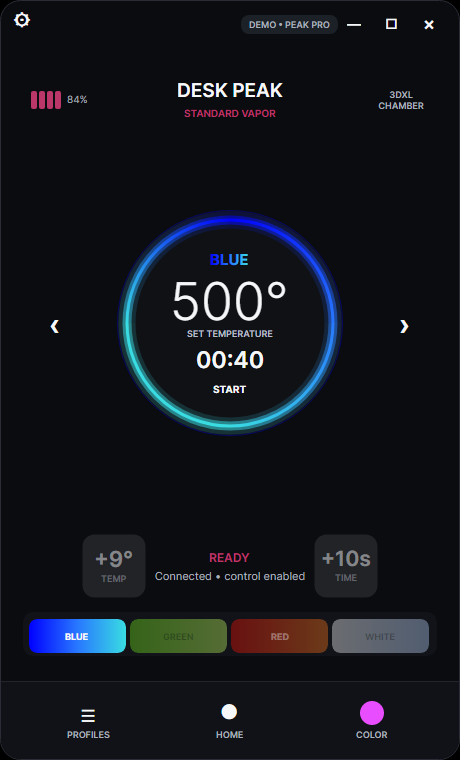
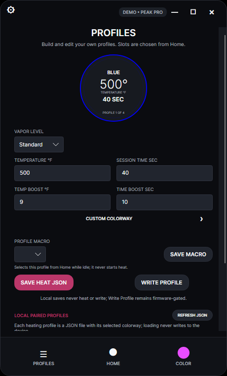
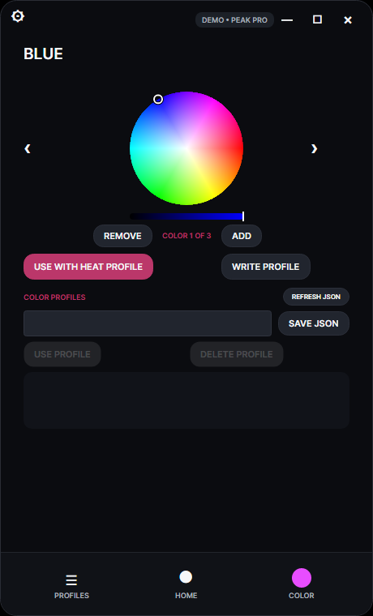
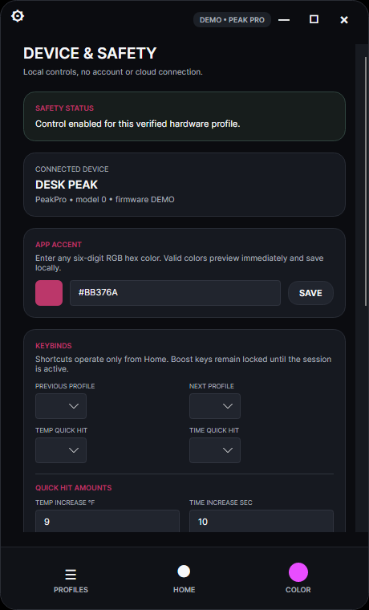

# desk_Puff

A compact Bluetooth controller for app-enabled Puffco e-rigs, in a small desktop
window. No accounts, advertising, location tracking, social features, or cloud
services.

> [!WARNING]
> Early, independent, and not affiliated with Puff Corp. Live device writes stay
> gated until an exact device and firmware combination has passed the hardware
> safety suite. Use the physical device button if software state is ever
> uncertain.



## Supported hardware

- Peak Pro Bluetooth bases with a 3D or 3DXL chamber
- Current app-enabled New Proxy bases (experimental discovery)

The base is the Bluetooth device. A 3D or 3DXL chamber is detected through its
base and never connects independently. Products without the app-enabled
Bluetooth service are out of scope. Exact support and verification status is in
[docs/COMPATIBILITY.md](docs/COMPATIBILITY.md).

## What works today

The interface is complete and runs from a deterministic demo client: profile
selection and editing, colorways, start and stop, quick hits, running a saved
profile for one session, and device handoff — all without opening Bluetooth or
touching hardware.

| Profiles | Color | Settings |
|---|---|---|
|  |  |  |

Profiles come in two kinds. The device's four slots behave as they always have.
Saved local profiles are JSON files that apply their parameters to a **single
session** and are dropped when it ends; selecting one writes nothing to a slot,
and the display says **SAVED PROFILE • NOT ON DEVICE** so it can never be
mistaken for the device's own state.

> [!IMPORTANT]
> **The Bluetooth path is written but not yet reachable in a build.** Bluetooth
> is opened by a separate Rust helper, `desk-puff-ble`, which the app expects at
> `ble/desk-puff-ble.exe` beside itself. Nothing in the build, publish profile,
> or CI compiles or stages that helper, so a published `desk_Puff.exe` cannot
> connect to anything. `--demo` is the only mode that runs end to end.

Real-device state-changing writes are locked because no model and firmware pair
has completed the owned-hardware safety sequence. The empty firmware allowlist
is enforced below the UI; changing or enabling a button cannot bypass it.

Running a saved profile for one session is implemented in the application and
the demo client only. The Bluetooth client does not implement that path, so on
hardware the app refuses and says so rather than starting the device's own slot.
The session-scoped paths `/p/app/tmpo` and `/p/app/timo` are allowlisted but
nothing writes them yet, and no session-scoped path is known for colorway or
vapor.

## Safety boundaries

The device firmware stays authoritative for heater control. The application
contains no firmware updater, bootloader access, debricking, factory reset, raw
command console, arbitrary Lorax path access, or automatic heating.

- Unknown devices and firmware are read-only.
- Commands are serialized; state-changing commands are at-most-once and are
  never blindly retried.
- Every value is validated against the device's own limits and a conservative
  absolute ceiling before encoding, and verified by read-back where the protocol
  allows it.
- Handoff is a controlled disconnect and reconnect, never a forced takeover. It
  cannot seize a base held by another controller or bypass Windows pairing.

Detail in [docs/SAFETY.md](docs/SAFETY.md),
[docs/THREAT_MODEL.md](docs/THREAT_MODEL.md), and [SECURITY.md](SECURITY.md).

## Run it

The published `desk_Puff.exe` is self-contained for 64-bit Windows 10/11.

```powershell
.\desk_Puff.exe --demo
```

`--demo` exercises the whole interface without opening Bluetooth or addressing
hardware. It never connects to an account or cloud service.

## Build and test

.NET 10 on Windows 10/11, Avalonia for the interface. A workspace-local SDK can
live in `.tools/dotnet` and is ignored by Git.

```powershell
dotnet restore .\desk_Puff.slnx --locked-mode
dotnet build   .\desk_Puff.slnx -c Release --no-restore
dotnet test    .\desk_Puff.slnx -c Release --no-build
dotnet format  .\desk_Puff.slnx --verify-no-changes --no-restore
```

`DEMO.cmd` publishes and launches the demo in one step.

Bluetooth additionally needs the Rust helper in `native/desk-puff-ble`, which is
a separate build and is **not** produced by the commands above.

## Architecture

Three layers, described in [docs/ARCHITECTURE.md](docs/ARCHITECTURE.md):

| | |
|---|---|
| `DeskPuff.Core` | models, typed device operations, safety policy, session state machine. No Windows or Bluetooth dependency. |
| `DeskPuff.Bluetooth.Windows` | the Lorax protocol and its transport. Writes are restricted by an exact path allowlist. |
| `DeskPuff.App` | Avalonia interface. Can request only typed operations. |

Bluetooth is not opened in process: a separate Rust executable speaks a JSON
protocol over stdin and stdout, and is resolved from a fixed path beside the
application.

## Contributing

Start with [CONTRIBUTING.md](CONTRIBUTING.md). Protocol or device-write changes
need tests, source attribution, an explicit safety argument, and owned-hardware
evidence before a firmware entry can enable writes. Report security issues
through [SECURITY.md](SECURITY.md), not a public issue containing sensitive
detail.

## License

Source-available for personal and other noncommercial use under the
[PolyForm Noncommercial License 1.0.0](LICENSE.md). Not OSI-approved
open source, because the license intentionally restricts commercial use.
